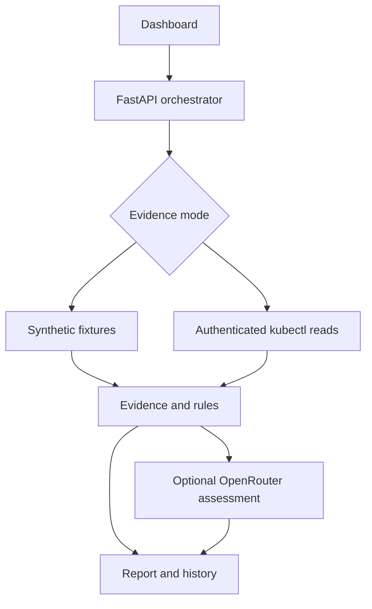

# KubeScope — AI DevOps Kubernetes Agent

A working implementation of [Abhishek Veeramalla's AI-DevOps-Kubernetes-Agent design](https://github.com/iam-veeramalla/AI-DevOps-Kubernetes-Agent), built by Rishabh Shukla.

The upstream repository contains an architecture document and five implementation prompts, not a runnable application. This project implements the investigation workflow with a Python/FastAPI backend, a responsive dashboard, explicit evidence references, read-only `kubectl` collection, and optional OpenRouter analysis.

## Try it

The public deployment runs **synthetic sample incidents with deterministic rules**. It does not connect to a real cluster, call an LLM, or execute repairs. Choose a scenario, run an investigation, inspect the evidence, and export the JSON report. Owner-only live and AI capabilities are implemented but require configuration.

## Features

- Seven public scenarios: CrashLoopBackOff, ImagePullBackOff, OOMKilled, Pending/FailedScheduling, Service selector mismatch, failed readiness probe, and a healthy baseline.
- Streaming progress from the FastAPI orchestration pipeline, not simulated timed animations.
- Correlated findings with evidence paths, explanatory next steps, prevention advice, and read-only diagnostic commands.
- Confidence is a qualitative rule-evidence label, **not a measured or calibrated accuracy score**.
- Authenticated live context selection from a server-mounted kubeconfig and an explicit namespace allowlist.
- Kubernetes evidence collection via argument-list subprocesses, timeouts, bounded resource scope, and no shell execution.
- Optional schema-validated OpenRouter assessment with timeouts, limited retry, and graceful fallback to rule findings.
- Public reports stay in browser storage. Live reports use owner-authenticated SQLite history and remain in browser memory only.
- JSON report export, responsive layout, keyboard controls, reduced-motion support, and no frontend framework build step.
- Automated tests for incident detection, authentication, collection boundaries, incomplete evidence, provider fallback, and report history.

## Architecture



This is an on-demand troubleshooting application, not a Kubernetes operator. It never applies YAML, restarts pods, deletes resources, or runs suggested fixes.

To keep deployment self-contained, this implementation uses a static dashboard instead of Next.js, streaming HTTP instead of InsForge realtime, and owner-token authentication plus SQLite/browser history instead of a hosted InsForge account. The original prompts are retained in `upstream/prompts/` for comparison.

## Run locally

From this project folder:

```bash
python -m venv .venv
# Windows PowerShell:
.venv\Scripts\Activate.ps1
# macOS/Linux: source .venv/bin/activate
pip install -r requirements.txt
python -m uvicorn app.main:app --host 127.0.0.1 --port 8000
```

Open http://127.0.0.1:8000. Interactive API documentation is at `/docs`, health is at `/health`. No credentials are needed for samples.

Alternatively, `docker compose up --build` starts the public demo on port 8000. The demo container intentionally does not bundle kubectl or a kubeconfig. For live mode, use the native Python process with kubectl installed, or create a private container image containing an appropriate kubectl version and mount a trusted config.

## Connect a real cluster

1. Install an official kubectl version compatible with your cluster and verify normal read-only access. The backend executes kubectl on **its own host**; a cloud service cannot see kubeconfig files on your PC.
2. Create namespace-scoped credentials using `k8s/read-only-rbac.yaml` as a starting point. It grants reads of pods, logs, events, services, deployments, and EndpointSlices. It does not grant Secret reads or write access. Change all namespace fields before applying to another namespace.
3. Mount a **trusted administrator-provisioned** kubeconfig on the server. Do not commit it or upload it into the public dashboard. Kubeconfigs can contain executable credential plugins; treat them as code.
4. Set server environment variables (the app reads the process environment; it does not automatically load `.env`):

| Variable | Purpose |
|---|---|
| `APP_AUTH_TOKEN` | Random owner token of at least 32 characters |
| `KUBECONFIG_PATH` | Absolute path to the trusted server-side kubeconfig |
| `KUBECTL_BIN` | Path to kubectl, default `kubectl` |
| `KUBE_NAMESPACES` | Comma-separated allowed namespaces; default `default` |
| `HISTORY_DB` | SQLite path on a persistent volume for durable history |
| `OPENROUTER_API_KEY` | Optional server-side provider key |
| `OPENROUTER_MODEL` | Explicit model identifier available to your account |
| `ALLOW_LIVE_LLM` | Default `false`; explicit opt-in to send live evidence to OpenRouter |

Generate the owner token privately with `python -c "import secrets; print(secrets.token_urlsafe(36))"`. In PowerShell set variables with `$env:NAME="value"`; in bash use `export NAME="value"`. Keep secrets out of source and shell scripts you commit.

5. Open **Live connection**, enter the owner token, choose a context and allowed namespace, then investigate. The token is kept in page memory and is never stored in localStorage or a URL. Serve remote owner access over HTTPS.

Live evidence is reduced to relevant status fields; pod environment values and Secret objects are never collected. Log redaction is best-effort and cannot guarantee removal of every secret. Live evidence remains on the server unless the owner enables `ALLOW_LIVE_LLM=true` **and** selects the OpenRouter checkbox for that run. Review the collected logs and provider data policy before enabling it.

Collection is intentionally bounded to namespaces of at most 100 pods. Logs are sampled from up to three unhealthy pods and two containers per pod, 60 lines/6 KB each. Only the 100 latest namespace events are retained. Missing checks are reported as warnings, and incomplete collection cannot produce an unqualified healthy result. DNS resolution, traffic probes, metrics-server memory measurements, and arbitrary shell commands are not implemented.

## Deploy

`render.yaml` describes a free Python web service. For this portfolio monorepo use:

- Root directory: `projects/AI_DevOps_Kubernetes_Agent`
- Build: `pip install -r requirements.txt`
- Start: `python -m uvicorn app.main:app --host 0.0.0.0 --port $PORT`
- Health check: `/health`
- Python: 3.12

Render Free services can sleep when idle; first load may take a moment. Their filesystem is ephemeral. Public sample history survives locally in the visitor's browser, but live SQLite history requires a persistent volume for durability. The project does not create paid resources or keep services awake. Free instance hours are shared with other free services in the same workspace; availability depends on remaining quota.

## API

| Endpoint | Access | Purpose |
|---|---|---|
| `GET /health` | Public | Liveness |
| `GET /api/config` | Public | Capability flags, never secret values |
| `GET /api/scenarios` | Public | Synthetic incident catalog |
| `POST /api/investigate` | Public demo / owner live | JSON investigation report |
| `POST /api/investigate/stream` | Public demo / owner live | NDJSON progress and final report |
| `GET /api/contexts` | Owner | Server kubeconfig context names and allowed namespaces |
| `GET /api/history` | Owner | Last 20 stored live reports |

Owner requests use `Authorization: Bearer <APP_AUTH_TOKEN>`. AI calls always require owner access. Public requests cannot supply provider keys, server paths, arbitrary commands, or Kubernetes credentials.

## Validation

```bash
pip install -r requirements-dev.txt
python -m pytest -q
node --check static/app.js
```

Live integration tests use mocked kubectl responses. Tests prove application behavior and its boundaries, not connectivity to a real cluster or quality of a configured model. Actual cluster and external LLM validation require the owner's infrastructure and credentials.

## Attribution and license

Original design and prompts: [iam-veeramalla/AI-DevOps-Kubernetes-Agent](https://github.com/iam-veeramalla/AI-DevOps-Kubernetes-Agent), upstream commit `11242e8be27a87005197a0ac26e0debf69e6d4ad`, Apache License 2.0.

Implementation and adaptation: Rishabh Shukla, September 2026. The upstream license is preserved in `LICENSE`; original prompt files remain under `upstream/`. This application is an independently implemented adaptation, not an endorsement by the upstream author.
